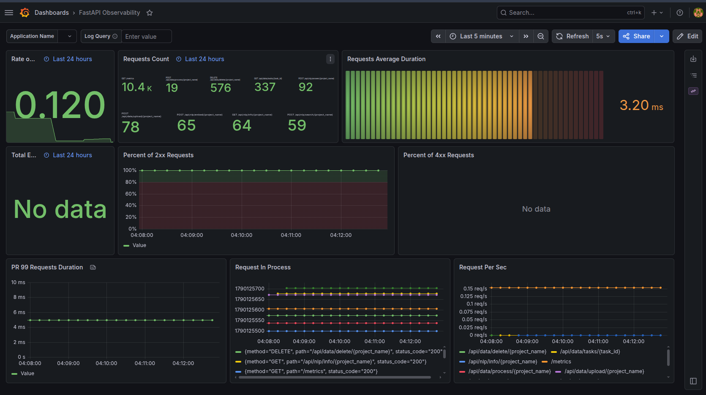
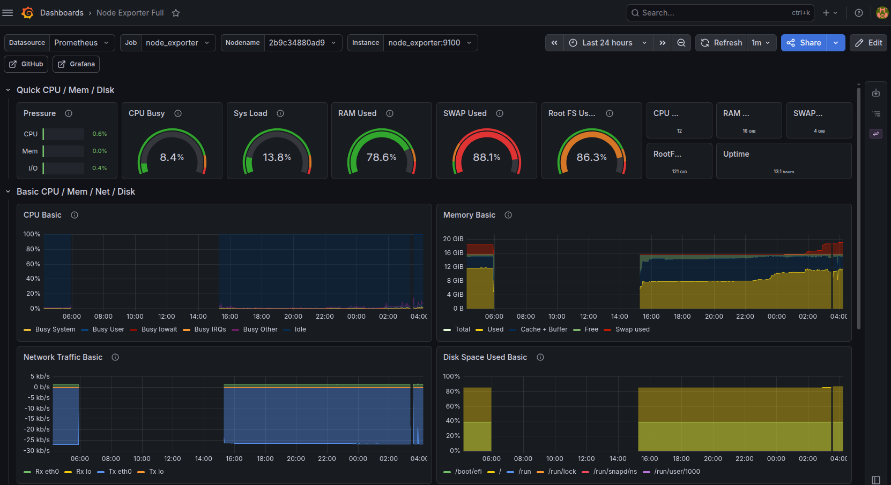
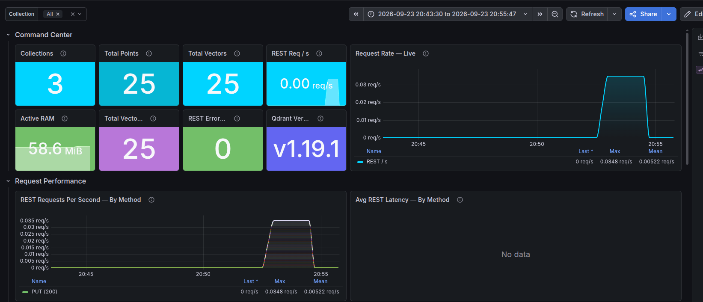
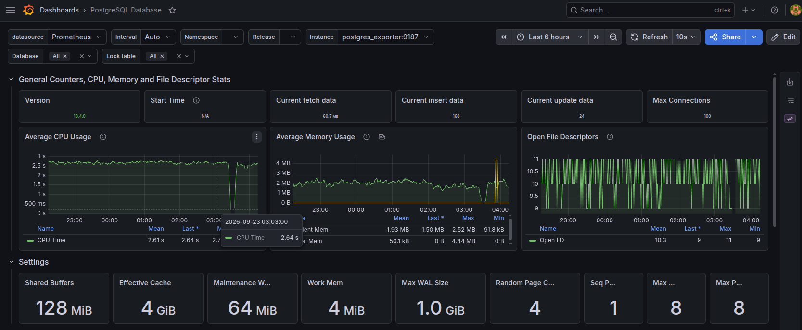
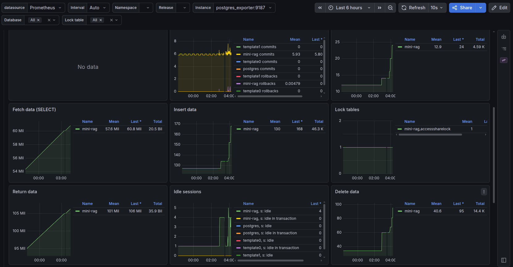
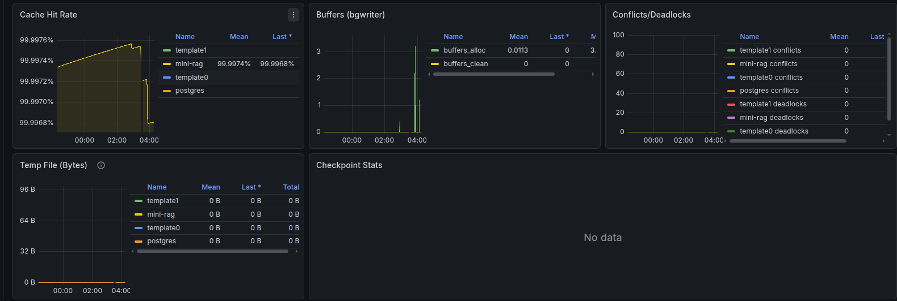

# Production RAG System

**Production RAG System** is a lightweight, modular, and production-ready backend API for Retrieval-Augmented Generation (RAG), built with FastAPI. It enables you to ingest multi-format documents, process complex PDFs with dedicated text, image, and table extraction, generate and store vector embeddings, perform semantic search, and serve AI-driven question answering—backed by full-stack observability with Prometheus and Grafana.

---

## Features & Technologies

- **FastAPI Core**: High-performance, asynchronous REST API with structured error handling and YAML-based logging.
- **Multi-Provider LLM & Embedding Support**: Integrations with OpenAI, Cohere, and Google Gemini for chat completion and embedding generation.
- **Modular Document Ingestion Engine**:
  - Dedicated file loaders for `.pdf`, `.docx`, `.html`, `.md`, and `.txt` files.
  - **Production-Grade PDF Pipeline**: Multi-channel layout analysis and extraction engine supporting text, images, and tables with Vision LLM (VLM) OCR capabilities. For full technical details and pipeline diagrams, see the **[PDF Pipeline Documentation](src/ingestion/README.md)**.  
    *(Note: Currently, extracting images and tables into the database is exclusively supported for PDF documents).*
- **Dual Vector Database Support**:
  - **Qdrant**: High-performance dedicated vector search engine.
  - **PostgreSQL (`pgvector`)**: Integrated vector similarity search directly within PostgreSQL.
- **Relational Metadata Management**: **PostgreSQL** handles project workspaces, file assets, and document chunk tracking.
- **Background Task Processing (Celery)**: Powered by RabbitMQ (broker) and Redis (backend) for handling heavy lifting asynchronously.
- **Full-Stack Observability & Metrics**: Built-in Prometheus instrumentation and Grafana dashboards for deep visibility.
- **Production Architecture**: Orchestrated via **Docker Compose** behind an **Nginx** reverse proxy.

---

## Architecture Flow & Code Design

### Project Flow
1. **Ingestion (`/upload`)**: Documents are uploaded to a specified project workspace. Metadata is stored in PostgreSQL.
2. **Processing (`/process`)**: Celery picks up a background task to parse, extract, and chunk the documents.
3. **Embedding (`/embed`)**: Another Celery background task generates embeddings for the text chunks using the configured LLM provider and stores them in the selected Vector DB (Qdrant or pgvector).
4. **Retrieval & QA (`/answer`)**: A user queries the system. The system embeds the query, searches the vector DB for the top `k` most relevant chunks, and passes them to the Chat LLM to generate a synthesized response.

### Extensibility & Design Patterns
The codebase is heavily modularized using **Factory, Repository, and Adapter patterns**. 
- **Database Abstraction**: Data access logic is isolated in models and controllers (e.g., `AssetModel`, `ChunkModel`). 
- **Service Factories**: `VectorDBProviderFactory` and `LLMProviderFactory` in `src/services/` instantiate the correct provider client based on the `.env` configuration.
- **Provider Adapters**: The system leverages the Adapter pattern to abstract away provider-specific API nuances. For example, the Google LLM provider implements an `EmbeddingAdapter` (`src/services/llms/providers/google/embedding_adapter.py`) to seamlessly support different generations of embedding models that expect task types to be passed in entirely different ways (via config vs. inline text prefixes).
- **Centralized Configuration**: A single `pydantic-settings` based `Settings` class (`src/utils/config.py`) loads and validates all environment variables from multiple `.env` files at startup, with computed fields that auto-construct database URLs, broker URIs, and storage configs.
- **Minimal Refactoring**: Switching from Qdrant to pgvector, or from OpenAI to Gemini, requires **zero code changes** to the core routing or business logic. You only need to update the environment variables, and the factory will inject the correct implementation at startup.

---

## Celery Background Workers

Heavy computational tasks, such as document parsing, chunking, and calling external LLM APIs for embedding generation, can significantly block the main FastAPI event loop. 

To solve this, we use **Celery** for asynchronous task execution:
- **Setup**: RabbitMQ acts as the message broker passing tasks to workers, while Redis stores the task state and results. Flower is used for monitoring Celery queues.
- **Usage**: When you hit the `/process` or `/embed` endpoints, FastAPI immediately returns a `task_id` while pushing the actual work to a RabbitMQ queue. 
- **Idempotency & Task Reliability**: An `IdempotencyManager` generates a deterministic UUID5 hash from each task's arguments and Celery ID. Before execution, it checks this hash against the `CeleryTaskExecution` table to prevent duplicate runs, tracks state transitions (`PENDING → STARTED → SUCCESS/FAILURE`), and auto-cleans stale records based on a configurable retention time.
- **Why it's useful**: This decoupling ensures the API remains fast, responsive, and highly available, even when processing hundreds of large PDF files simultaneously. You can poll the `/tasks/{task_id}` endpoint to check the state of your task.

---

## Available API Endpoints

The system provides a comprehensive set of RESTful endpoints divided into two main routers:

### Data Management (`/api/data`)
- `POST /upload/{project_name}`: Upload multi-format documents to a project.
- `POST /process/{project_name}`: Start a Celery background task to parse and chunk uploaded files.
- `GET /tasks/{task_id}`: Poll the status of an asynchronous Celery task.
- `DELETE /delete/{project_name}`: Wipe a project, its metadata, files, and vector DB collections entirely.

### NLP & Search (`/api/nlp`)
- `POST /embed/{project_name}`: Start a Celery task to generate embeddings for processed chunks and insert them into the Vector DB.
- `GET /info/{project_name}`: Retrieve metadata about a project's vector database collection.
- `POST /search/{project_name}`: Perform a semantic vector search returning raw similar chunks.
- `POST /answer/{project_name}`: Perform a full RAG workflow, returning an AI-synthesized answer based on the retrieved context.

---

## Prerequisites

- **Docker & Docker Compose** — The application is fully containerized; all services are orchestrated via Docker Compose.
- **Git** — To clone the repository.
- **LLM API Key** — At least one provider key (OpenAI, Cohere, or Google Gemini) for chat completion and embedding generation.
- **VLM / OCR Endpoint** *(for PDF processing)* — A Vision Language Model endpoint (local Ollama, OpenAI-compatible, or Hugging Face) for the PDF pipeline's OCR and image description capabilities.
- **Cloudflare R2 Bucket** *(optional)* — Required only if you use the PDF pipeline's image extraction feature, which uploads cropped images to R2 cloud storage.

---

## Setup & Execution

### 1. Clone the Repository
```bash
git clone https://github.com/AhmeDHasan-110/mini-RAG.git
cd mini-RAG
```

### 2. Docker Deployment
The application and all supporting services are fully containerized. 

For step-by-step instructions on setting up environment files (`.env.app`, `.env.postgres`, etc.), starting services, managing Docker volumes, and importing Grafana dashboards, please head over to the **[Docker Setup README](docker/README.md)**.

Quick launch summary:
```bash
cd docker
# Create environment files as described in docker/README.md, then run:
docker compose up --build -d
```

*(Note: A ready-to-use Postman Collection is provided to let you inspect and execute all API endpoints immediately: [`postman/mini-rag-v2.0.0-api.postman_collection.json`](postman/mini-rag-v2.0.0-api.postman_collection.json))*

---

## Deployment Strategy

The project is structured to be deployed automatically to cloud virtual machines.
- **Hosting**: Deployed on an **AWS Lightsail** instance.
- **CI/CD Pipeline**: GitHub Actions is configured to trigger on pushes to the main branch. The workflow authenticates via SSH into the AWS Lightsail machine, pulls the latest code, and runs `docker compose up --build -d`.
- **System Service**: A `systemd` `.service` file is configured on the AWS instance. This ensures that the Docker application stack automatically restarts and recovers if the server is rebooted or encounters a power shutdown.

🔷 Access the app at: [RAG System app](http://51.24.201.251/api/) \
🔷 Try the endpoints at the swagger page: [Swagger](http://51.24.201.251/docs)

---

## Observability & Metrics

All data is scraped by Prometheus and visualized in auto-provisioned Grafana dashboards (`http://localhost:3000`).

- **Application Performance**: Custom metrics exposed via `/metrics` which track FastAPI request latencies, p99 duration, HTTP error rates, and endpoint throughput.
  
  

- **Host Metrics**: **Node Exporter** captures hardware usage (CPU, Memory, Disk I/O, Network) of the AWS instance.
  

- **Vector DB Health**: Qdrant natively exports metrics detailing tracks total collections, RAM/CPU usage, IO Operations — Per Collection, active RAM, and search latency.
  

- **Relational DB Health**: Postgres Exporter tracks active connections, cache hit ratios, deadlocks, and query performance inside PostgreSQL.
  
  
  

---

## Project Structure

```text
Production-RAG-System/
├── .github/workflows/      # GitHub Actions CI/CD pipeline (AWS Lightsail deploy)
├── docker/                 # Docker Compose, Nginx, Prometheus, & Grafana configs
├── postman/                # Postman API Collection
├── src/
│   ├── controllers/        # Business logic for Data, Process, and NLP
│   ├── ingestion/          # Document loaders & production PDF processing pipeline
│   ├── models/             # Database & Vector DB schemas
│   ├── routes/             # FastAPI routers (/data, /nlp)
│   ├── services/           # LLM and Vector DB client adapters (Factories)
│   ├── utils/              # Centralized config (pydantic-settings) & Prometheus metrics
│   ├── worker/             # Celery app, tasks, and idempotency tracking
│   ├── exceptions.py       # Custom exception classes
│   └── main.py             # FastAPI entrypoint
├── .env.example            # Environment variables template
├── logging_config.yml      # YAML-based logging configuration
└── pyproject.toml          # Project dependencies
```

---

## License

This project is open-source and licensed under the [MIT License](LICENSE).
