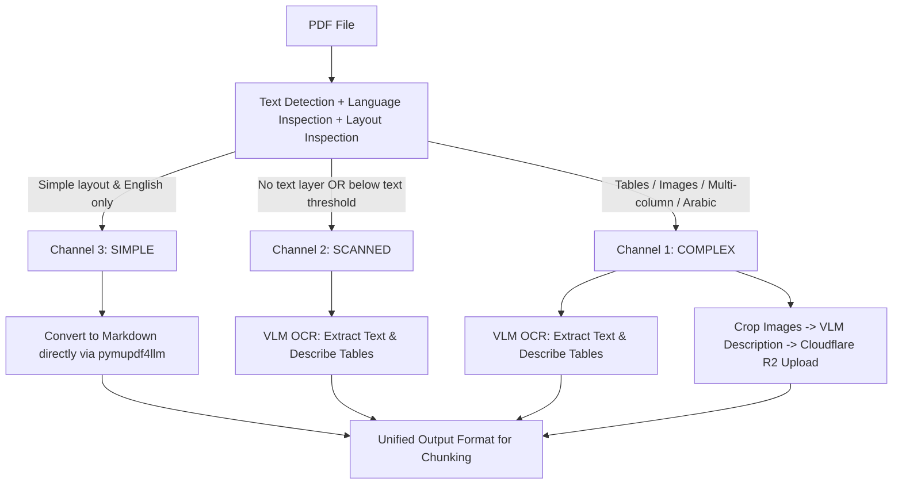

# Document Ingestion Engine & PDF Processing Pipeline

This directory (`src/ingestion`) contains the document loading, layout analysis, multi-channel extraction, and text chunking engine for **mini-RAG**. 

It handles multi-format document parsing (`.pdf`, `.docx`, `.html`, `.md`, `.txt`) and normalizes extracted contents into a unified `LoadedDocument` schema, ready for recursive token-based chunking and vector embedding generation.

---

## 📁 Directory Architecture

```text
src/ingestion/
├── chunkers/
│   └── recursive_chunking.py   # Tiktoken-aware recursive & markdown-header text splitter
├── loaders/
│   ├── base.py                 # Abstract loader interface & @register_loader decorator
│   ├── dispatcher.py           # Extension-based file loading router (load_file)
│   ├── docx_loader.py          # Microsoft Word (.docx) document loader
│   ├── html_loader.py          # HTML document loader with BeautifulSoup parser
│   ├── markdown_loader.py      # Markdown (.md) parser with section header extraction
│   ├── pdf_loader.py           # PDF loader entrypoint (connects PDFProcessor & classifier)
│   ├── schemas.py              # LoadedDocument, DocumentMetaData, & ProcessingOutputType models
│   └── txt_loader.py           # Plain text (.txt) file loader
└── pdf_pipeline/
    ├── channel_processors/
    │   ├── channel_processor_interface.py # Abstract base interface for channel processors
    │   ├── complex_channel_processor.py   # OCR, table extraction, VLM image description & R2 upload
    │   ├── scanned_channel_processor.py   # Scanned page OCR & table extraction
    │   ├── simple_channel_processor.py    # Fast text-to-markdown extraction (pymupdf4llm)
    │   └── images_storage.py              # Cloudflare R2 image storage adapter
    ├── classifier.py           # Page classification engine (SIMPLE, SCANNED, COMPLEX)
    ├── enums.py                # ProcessingChannel & PDFLanguage enumerations
    ├── ocr_prompts.yml         # VLM system prompts for OCR, table XML formatting & image descriptions
    └── processing.py           # Multi-channel PDF processor orchestrator (PDFProcessor)
```

---

## Document Loaders (`loaders/`)

All document loaders subclass `BaseLoader` and register their target file extension using the `@register_loader('.ext')` decorator. The `dispatcher.py` module acts as the single routing entrypoint (`load_file`), dynamically dispatching files based on extension.

| Loader | File Extension | Strategy & Capabilities |
| :--- | :--- | :--- |
| `PdfLoader` | `.pdf` | Delegates to the **PDF Processing Pipeline** for multi-channel page classification, VLM OCR, table XML parsing, image description generation, and R2 cloud storage upload. |
| `DocxLoader` | `.docx` | Extracts text paragraphs and tables from Word documents using `python-docx`. |
| `HtmlLoader` | `.html` | Strips HTML boilerplate and extracts structured text alongside header tags (`<h1>`-`<h6>`) using `beautifulsoup4`. |
| `MarkdownLoader` | `.md` | Parses Markdown files into logical section blocks based on ATX headers (`#`, `##`, etc.). |
| `TxtLoader` | `.txt` | Loads plain text files directly into normalized `LoadedDocument` structures. |

All loaders output a list of `LoadedDocument` objects, guaranteeing a consistent interface across the entire ingestion engine.

---

## In-Depth: Production PDF Processing Pipeline (`pdf_pipeline/`)

PDF documents represent the vast majority of real-world RAG datasets. However, standard text extraction libraries frequently fail on scanned pages, multi-column layouts, embedded tables, images, and non-Latin scripts (such as Arabic).

To solve this, `mini-RAG` implements a **production-grade multi-channel PDF processing pipeline** designed to achieve an optimal balance between **accuracy, speed, compute efficiency, privacy, and minimal data loss**.

---

### 1. VLM Flexibility & Model Support

The PDF processing engine relies on Vision Language Models (VLMs) for OCR, table extraction, and image description generation.

It supports:
- **Local Ollama Models** (e.g., `llama3.2-vision`, `llava`, `qwen2-vl`) for zero-cost, private processing.
- **Any OpenAI-Compatible VLM Endpoint** (e.g., OpenAI `gpt-4o-mini`/`gpt-4o`, OpenRouter, vLLM, Hugging Face TGI).

---

### 2. Page Classification Engine (`classifier.py`)

Rather than passing every page to an expensive VLM call, `classify_doc_pages()` analyzes page metadata and layout heuristics using PyMuPDF, routing each page into one of three processing channels:



#### Processing Channels Breakdown:

1. **`SIMPLE` Channel (`SimpleChannelProcessor`)**:
   - **Criteria**: English-only text layer, single-column layout, no tables, and no embedded images.
   - **Execution**: Extracted directly using `pymupdf4llm.to_markdown()` without calling VLM models.
   - **Benefits**: Near-instant execution, zero API token cost.

2. **`SCANNED` Channel (`ScannedChannelProcessor`)**:
   - **Criteria**: Pages with no text layer, or character count below `SCANNED_PAGE_TEXT_MAX_LIMIT`, or max image area ratio exceeding `SCANNED_PAGE_MIN_RATIO_LIMIT`.
   - **Execution**: The page is rendered into a high-DPI image and sent to the VLM OCR engine.
   - **Table Protocol**: When the VLM encounters a table, it wraps it in a strict XML structure defined in `ocr_prompts.yml`:
     ```xml
     <table_block>
     <description>1-3 line summary of table content, context, and key metrics</description>
     <markdown>
     | Header 1 | Header 2 |
     | -------- | -------- |
     | Value 1  | Value 2  |
     </markdown>
     </table_block>
     ```
   - **Note**: Standalone visual images are ignored on scanned pages.

3. **`COMPLEX` Channel (`ComplexChannelProcessor`)**:
   - **Criteria**: Pages containing tables, multi-column text layouts, embedded images, or Arabic/mixed script.
   - **Execution**: Executes two concurrent tasks via `asyncio.gather()`:
     - **Task A (Layout & Table OCR)**: Renders the page and converts text and tables to Markdown via VLM OCR (wrapping tables in `<table_block>` XML structures while ignoring embedded images).
     - **Task B (Image Extraction & Description)**: Extracts embedded image XREFs from the page object. For each valid image:
       1. Renders and base64-encodes the image crop.
       2. Sends the crop to the VLM using `image_description_prompt` to generate a detailed retrieval description.
       3. Uploads the image binary to **Cloudflare R2** storage.
       4. Binds the public image URL with the VLM description in document metadata.

---

### 3. Post-Processing & Output Normalization

Following channel execution, results are processed into standardized `LoadedDocument` objects:

- **Table Normalization**: Regex extracts `<table_block>` XML structures from Markdown. The raw table Markdown is stored in `metadata.table_md`, while the table's description is indexed as searchable text (`doc_type = "table"`).
- **Image Normalization**: The VLM image description is indexed as searchable text (`doc_type = "image"`), while the public Cloudflare R2 URL is attached in `metadata.img_url`.
- **Output Schema**:
  ```python
  LoadedDocument(
      text="Page markdown content OR table/image description",
      metadata=DocumentMetaData(
          doc_type=ProcessingOutputType.TEXT, # 'text', 'table', or 'image'
          source="/path/to/document.pdf",
          format=".pdf",
          page=1,
          total_pages=10,
          section="<Section title>",
          section_level=1,
          img_url="https://r2-bucket.pub/image_key.png",
          table_md="| Col 1 | Col 2 |\n..."
      )
  )
  ```

---

### 4. Architectural Design Decisions ("The Whys")

- **Why ignore images on scanned pages?**  
  An image description without a clean, cropped image asset offers limited utility in RAG search. On scanned pages, individual visual elements are hard to extract as separate image assets.
- **Why support local VLMs (Ollama / OpenAI-compatible)?**  
  Ensures data privacy, reduces third-party LLM API costs for large multi-page documents, and enables offline or self-hosted deployment.
- **Why generate image descriptions in separate VLM calls?**  
  Inline image descriptions generated during page OCR struggle with reliable image-to-text association in multi-column layouts. Extracting images directly via PyMuPDF XREFs guarantees an exact 1:1 match between image crops, descriptions, and uploaded cloud URLs.
- **Why classify Arabic PDFs directly as complex?**  
  Standard Python PDF extraction libraries (PyPDF, pdfplumber, PyMuPDF) fail to parse right-to-left Arabic script accurately, causing garbled or reversed text. VLM OCR processes visual text blocks directly, reconstructing natural Arabic reading order flawlessly.

---

## Text Chunking Engine (`chunkers/`)

The `chunkers/` module provides `chunk_recursively()`, wrapping LangChain's `RecursiveCharacterTextSplitter` powered by `cl100k_base` tiktoken encoding.

- **Markdown Header Awareness (`split_on_atx_first=True`)**: Pre-splits documents using `MarkdownHeaderTextSplitter` along ATX headers (`#`, `##`, `###`, `####`) to preserve semantic section headers before splitting into fixed token chunks.
- **Metadata Preservation**: Inherits all document metadata (`source`, `page`, `format`, `doc_type`, `img_url`, `table_md`) across all generated chunks.
